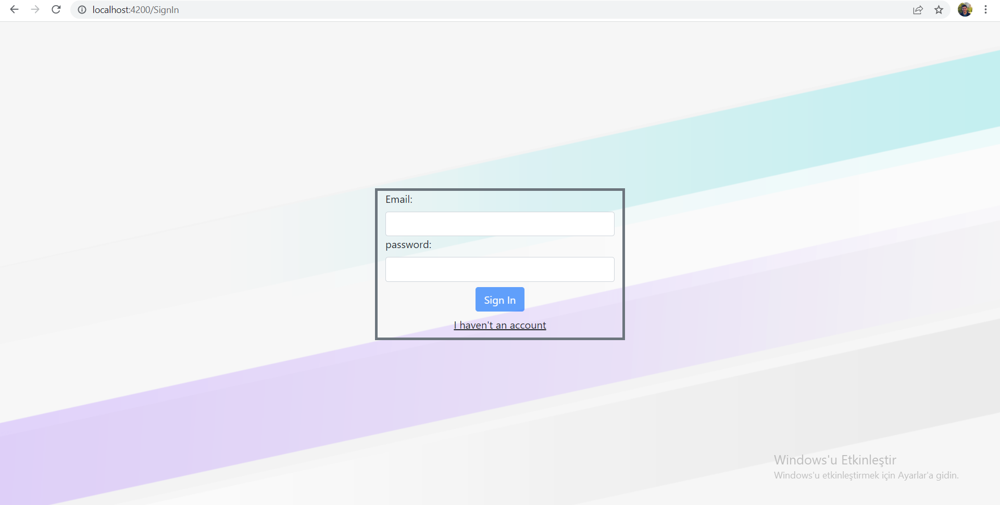
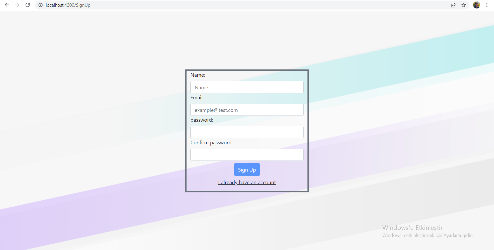
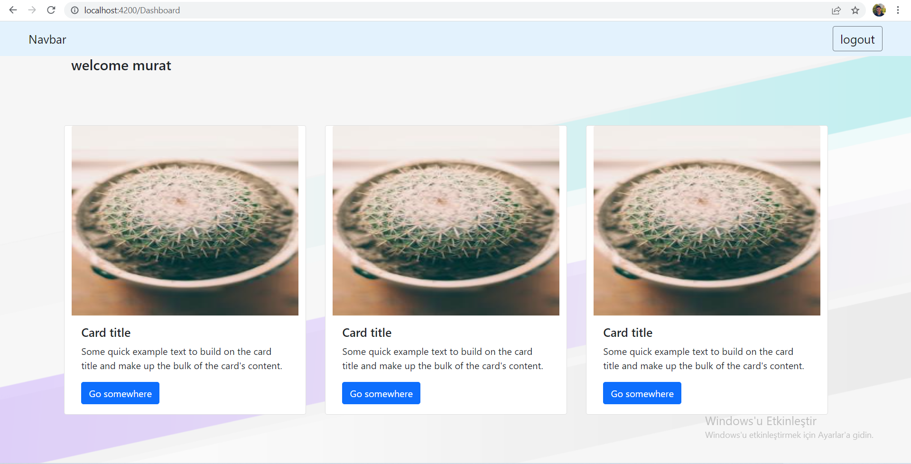

# 3. Hafta Ödevi

# Projeyi çalıştırmak
Bu projede json-server kullanılmıştır. json-server i ayağa kaldırmak için terminale aşağıdaki kodu yazınız.
```
npm run start-server
 ```

ardından terminale aşağıdaki kodu giriniz.
```
npm run start
```

# Proje sayfaları

 giriş ekranı
 
 kayıt ekranı  
 
 dashboard
 

# Proje hakkında 

Bir web uygulamasında kullanıcı kaydı ve kullanıcı girişi demosu hazırlayınız. Reactive form yaklaşımı kullanınız ve validasyonlarla 
uygulamanın güvenilirliğini sağlayınız. Hata mesajları ile kullanıcı dostu bir tasarım kurgulayınız. Kullanıcı kayıtlarını bir json dosyasına
yazdırıp, kullanıcı girişi yapılırken bu json dosyasından kontrol sağlayınız. Kullanıcı girişi yapıldıktan sonra herhangi bir içerik gösteriniz.
Kullanıcı girişi yapılmadan uygulama da ki içerikler görüntülenmemlidir. 
(Kullanıcı girişi yapıldıktan sonra, Local Storage da kullanıcı bilgileri saklanabilir)

https://github.com/typicode/json-server api uygulama için kullanılabilir.
